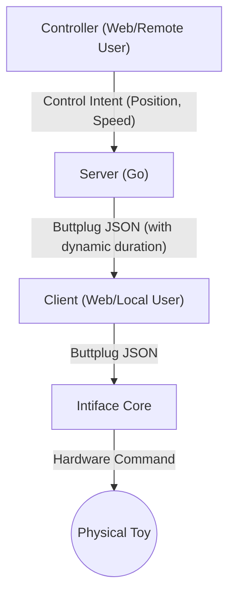
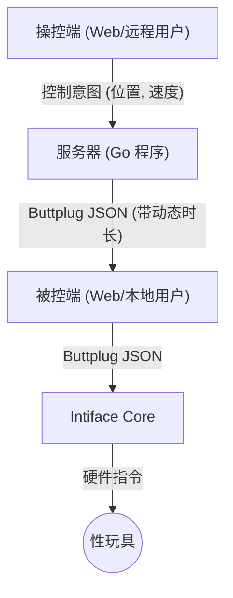

# Web-based Remote Toy Control System

This is a remote toy control system based on Go and WebSocket. It allows a user (the controller) to control a physical toy connected to another computer (the client) in real-time through a web interface.

## Core Architecture

The project consists of three main components, with the Go server acting as the bridge between them:

1.  **Controller**: A web application located in the `controller/` directory. The user expresses control intentions (e.g., desired toy position and movement speed) through its UI (like a slider).
2.  **Server**: The Go program in this directory. It acts as an intelligent WebSocket server, receiving commands from the controller, processing and transforming them, and then forwarding them to the client.
3.  **Client**: A web application in the `client/` directory. It runs on the computer connected to the physical toy, responsible for connecting to the Go server to receive commands and simultaneously connecting to the local Intiface Core software to send the final commands to the toy.

### Information Flow



## Go Server Features (`server/main.go`)

The Go server is more than just a simple message forwarder; it acts as an intelligent intermediary. Its core value lies in translating the user's smooth operations into precise commands that the device can understand.

*   **Connection Management**:
    *   Accepts WebSocket connections on `/ws`, distinguishing between `?type=controller` and `?type=client`.
    *   Uses a `?key=some_room_key` to pair a controller and a client into the same `Room` for an isolated session.

*   **State Synchronization**:
    *   Tracks the state of each room (e.g., `waiting_client`, `waiting_toy`, `ready`) and sends these status updates to both parties, allowing their UIs to display correct information.

*   **Intelligent Command Processing & Translation**:
    *   **Receives Intent**: Gets a `ControlMessage` with the desired `Position` and `Speed` from the controller.
    *   **Calculates Duration Dynamically**: This is the server's key feature. Instead of directly using the speed, it calculates a very short movement `Duration` based on the difference between the target position and the last commanded position. This logic is in the `constructLinearCmd` function.
    *   **Constructs Buttplug Commands**: Packages the calculated duration and target position into a `Buttplug` protocol standard `LinearCmd` JSON message, which Intiface Core understands.
    *   **Forwards Commands**: Sends the constructed Buttplug JSON message to the corresponding client in the same room.

*   **Device Management**:
    *   Receives and stores the `DeviceIndex` of the available toy from the client.
    *   Uses this `DeviceIndex` when constructing commands to ensure they are sent to the correct device.

## How to Run (Manual)

1.  **Start the Server**:
    ```bash
    cd GO/server
    go run main.go
    ```
    The server runs on port `8080` by default.

2.  **Open the Client End**:
    *   On the computer with Intiface and the toy connected, open a browser to `http://localhost:8080/client/?key=YOUR_SECRET_KEY`.
    *   The page will attempt to connect to the local Intiface Core (`ws://localhost:12345`) and report device status.

3.  **Open the Controller End**:
    *   On any other device (phone or computer), open a browser to `http://[SERVER_IP]:8080/controller/?key=YOUR_SECRET_KEY`.
    *   Using the same `key` will pair it with the client end, allowing you to start remote control.

## Deploying to a Server with Docker (Recommended)

This is the most recommended way to deploy this application to a production server. It packages the app and all its dependencies into a standard, portable image, ensuring environmental consistency and deployment convenience.

### Step 1: Prepare the Server Environment

First, you need to install Docker on your cloud server.

1.  **Connect to your server via SSH**.

2.  **Install Docker Engine**.
    Run the official one-click installation script, which is the easiest way to install Docker on a new server:
    ```bash
    curl -fsSL https://get.docker.com -o get-docker.sh
    sudo sh get-docker.sh
    ```

3.  **(Optional but highly recommended) Configure Docker to run as a non-root user**.
    This allows you to run `docker` commands without `sudo`.
    ```bash
    # Add the current user (`$USER`) to the docker group
    sudo usermod -aG docker $USER
    ```
    **Important**: After running this command, you need to **log out of your SSH session and reconnect** for the permission changes to take effect.

### Step 2: Build the Docker Image

With the server ready, you need to get the project files onto it and build the image.

1.  **Get the project files on the server**.
    The most recommended way is to use Git to clone your project repository.
    ```bash
    # Clone this repository
    git clone https://github.com/jerrymakefun/remotetoys.git
    ```
    If the project is not hosted, you can also use tools like `scp` to upload the local `GO` folder to the server.

2.  **Navigate to the project directory and build the image**.
    ```bash
    # Navigate to the directory containing the Dockerfile
    cd remotetoys/GO/
    
    # Build the Docker image
    # `.` indicates that the Dockerfile is in the current directory
    # `-t` is used to name (tag) the image
    docker build -t webrtc-server .
    ```
    This process may take a few minutes as it needs to download the Go base image and compile the code.

### Step 3: Run the Application Container

Once the image is successfully built, you can run it with a single command.

1.  **Run the container**.
    ```bash
    docker run -d -p 8080:8080 --restart always --name my-webrtc-app webrtc-server
    ```
    Parameter explanation:
    *   `-d`: **Detached mode** (runs in the background).
    *   `-p 8080:8080`: **Port mapping**. Maps port `8080` of the server to port `8080` inside the container.
    *   `--restart always`: **Automatic restart**. If the container exits unexpectedly, Docker will automatically restart it.
    *   `--name my-webrtc-app`: Gives the container a memorable **name** for easy management.
    *   `webrtc-server`: The name of the image to run.

### Step 4: Verification and Management

*   **Access the application**: Open a browser and go to `http://[YOUR_SERVER_IP]:8080`.
*   **Check running status**: `docker ps`
*   **View application logs**: `docker logs my-webrtc-app`
*   **Stop the container**: `docker stop my-webrtc-app`
*   **Restart the container**: `docker start my-webrtc-app`

## Updating the Application

To update your running application with the latest code from GitHub, follow these steps on your server.

1.  **Navigate to the project directory and pull the latest changes**:
    ```bash
    cd remotetoys/GO/
    git pull
    ```

2.  **Rebuild the Docker image with the new code**:
    ```bash
    docker build -t webrtc-server .
    ```

3.  **Stop and remove the old container**:
    ```bash
    docker stop my-webrtc-app
    docker rm my-webrtc-app
    ```

4.  **Start a new container with the updated image**:
    ```bash
    docker run -d -p 8080:8080 --restart always --name my-webrtc-app webrtc-server
    ```
Your application is now running with the latest version.
---

<details>
<summary>中文说明 (Chinese Documentation)</summary>

# Web 远程性玩具控制项目

这是一个基于 Go 和 WebSocket 的远程性玩具控制系统。它允许一个用户（操控端）通过网页界面，实时、流畅地远程控制另一台电脑（被控端）上连接的物理玩具。

## 核心架构

本项目由三个主要部分组成，Go 服务器是连接它们的桥梁：

1.  **操控端 (Controller)**: 一个位于 `controller/` 目录的 Web 应用。用户通过此界面的 UI（如滑块）来表达控制意图（例如，期望的玩具位置和移动速度）。
2.  **服务器 (Server)**: 本目录下的 Go 程序。它是一个 WebSocket 服务器，作为智能中间人，接收来自“操控端”的指令，进行处理和转换，然后转发给“被控端”。
3.  **被控端 (Client)**: 一个位于 `client/` 目录的 Web 应用。它运行在连接着物理玩具的电脑上，负责连接 Go 服务器以接收指令，并同时连接到本地的 `Intiface Core` 软件，将最终指令发送给玩具。

### 信息流



## Go 服务器功能详解 (`server/main.go`)

Go 服务器不仅仅是一个简单的消息转发器，它扮演着一个智能中间人的角色，其核心价值在于将用户的平滑操作转换为设备能理解的精确指令。

*   **连接管理 (Connection Management)**:
    *   通过 WebSocket (`/ws`) 接收连接，并使用查询参数 `?type=controller` 或 `?type=client` 来区分连接类型。
    *   使用 `?key=some_room_key` 来将一个“操控端”和一个“被控端”配对到同一个“房间”(`Room`)里，实现独立的控制会话。

*   **状态同步 (State Synchronization)**:
    *   服务器实时跟踪每个房间的状态（如 `waiting_client`, `waiting_toy`, `ready`），并将这些状态更新发送给双方，以便它们在 UI 上显示正确的信息。

*   **智能指令处理与转换 (Command Processing & Translation)**:
    *   **接收指令**: 从“操控端”接收包含期望**位置** (`Position`) 和**速度** (`Speed`) 的 `ControlMessage`。
    *   **动态计算时长 (Duration)**: 这是服务器最关键的智能所在。它不直接使用操控端发来的速度，而是根据收到的**目标位置**和服务器自己记录的**上一次命令的位置**之间的差距，以及操控端提供的速度参考，动态地计算出一个非常短的**运动时长** (`Duration`)。这个核心逻辑在 `constructLinearCmd` 函数中实现。
    *   **构造 Buttplug 指令**: 将计算出的时长和目标位置，打包成一个符合 `Buttplug` 协议标准的 `LinearCmd` JSON 消息，这是 `Intiface Core` 能理解的格式。
    *   **转发指令**: 将构造好的 `Buttplug` JSON 消息发送给同一房间里的“被控端”。

*   **设备管理 (Device Management)**:
    *   服务器会从“被控端”接收并存储可用玩具的 `DeviceIndex`。
    *   在构造 `Buttplug` 指令时，服务器会使用这个 `DeviceIndex`，以确保指令发送给正确的设备。

## 如何运行 (手动)

1.  **启动服务器**:
    ```bash
    cd GO/server
    go run main.go
    ```
    服务器默认在端口 `8080` 上运行。

2.  **打开被控端**:
    *   在连接了 Intiface 和玩具的电脑上，打开浏览器并访问 `http://localhost:8080/client/?key=YOUR_SECRET_KEY`。
    *   页面会尝试连接到本地的 Intiface Core (`ws://localhost:12345`) 并上报设备信息。

3.  **打开操控端**:
    *   在任何其他设备（手机或电脑）上，打开浏览器并访问 `http://[服务器IP]:8080/controller/?key=YOUR_SECRET_KEY`。
    *   使用相同的 `key` 即可与被控端配对，开始远程控制。

</details>